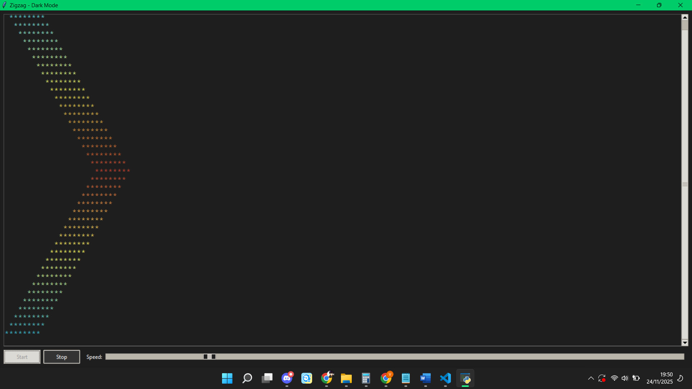

# Simple Zigzag Python (Tugas UTS Semester 5)

Program ini menampilkan animasi teks bergerak berbentuk zigzag dengan efek gradasi warna Cold → Normal → Hot, serta dark mode UI. Aplikasi dibangun menggunakan Python Tkinter dan mendukung pengaturan speed/FPS secara real-time.

Animasi menampilkan baris teks "********" yang bergerak ke kiri–kanan dengan warna yang berubah secara halus berdasarkan posisi. Efek glow ditambahkan agar warna tampak lebih hidup.

## ✨ Fitur Utama
🌗 Dark Mode UI

- Antarmuka telah dioptimalkan dengan warna gelap menggunakan ttk.Style agar nyaman dilihat.

🔥 Gradasi Warna Dinamis

Perubahan warna bertahap:

- Cold → biru terang (0, 220, 255)
- Normal → kuning (255, 255, 0)
- Hot → merah (255, 30, 0)

⚙️ Pengaturan Kecepatan (FPS)

- Slider memungkinkan pengguna mengubah kecepatan animasi dari 2–60 FPS.

▶️ Start & Stop Animation

- Tombol kontrol untuk memulai dan menghentikan animasi kapan saja.

🧮 Logic Animasi Zigzag

- Indentasi teks bergerak naik-turun (bolak-balik) sehingga menciptakan pola zigzag.

## Installation

```bash
git clone https://github.com/valeriankaleb/UTS_PemrogramanPythonLanjut_23.83.0965.git
cd UTS_PemrogramanPythonLanjut_23.83.0965
```

## Usage

```python
python zigzag.py
```

## Screenshot


## Contributing

Pull requests are welcome. For major changes, please open an issue first
to discuss what you would like to change.

Please make sure to update tests as appropriate.